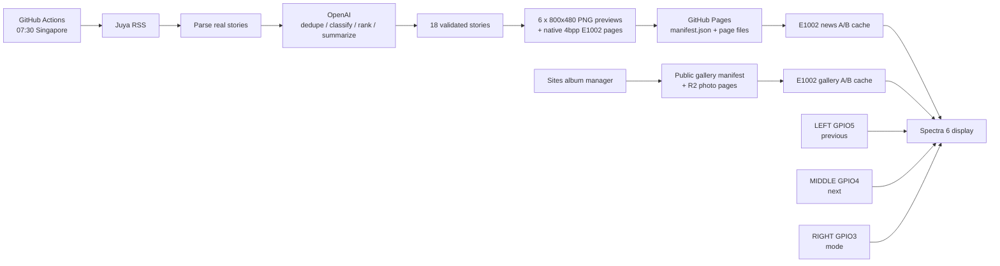

# reTerminal E1002 AI Daily News Display

An end-to-end daily AI news and photo display for the Seeed Studio reTerminal E1002. A GitHub Actions backend turns the newest [Juya AI Daily RSS](https://daily.juya.uk/rss.xml) content into exactly 18 source-traceable Chinese stories and deploys six e-paper pages to GitHub Pages. A separate Sites app manages an up-to-20-photo album, ordering, and playback interval. The ESP32-S3 remains a small display client: it downloads, validates, caches, and rotates both modes.

## Architecture



The backend is the only component that sees `OPENAI_API_KEY`. The device only receives public image bytes and their manifest.

## Repository layout

```text
.
├── backend/                  RSS parsing, curation, rendering, tests
├── firmware/                 PlatformIO ESP32-S3 application
│   ├── include/config.h      local credentials; gitignored
│   └── include/config.example.h
├── public/                   deployable news manifest and page assets
├── gallery-admin/            independent Sites source repository; parent-gitignored
├── backups/                  local factory flash backup; gitignored
└── .github/workflows/daily.yml
```

Each public page has two files:

- `page_N.png`: an exact 800×480 six-color preview for inspection;
- `page_N.epd`: 192,000 bytes of packed native E1002 pixels (two 4-bit pixels per byte).

The native format uses the nibble values verified in Seeed's official E1002 image pipeline: white `0x0`, green `0x2`, red `0x6`, yellow `0xB`, blue `0xD`, black `0xF`. Four bits are the storage container, not a claim that the panel has 16 colors: only those six codes are valid, so the native information capacity is `log2(6) ≈ 2.58` bits per pixel. Photos use Floyd–Steinberg error diffusion to arrange the six pigments into visually richer intermediate tones; every physical pixel still shows exactly one of the six colors.

News body text and metadata are black. Category accents may use dark blue, red, or green; yellow is excluded from news text because its contrast is poor. Album photos may use all six pigments.

## Verified hardware

The connected device was probed on `/dev/cu.usbserial-110` before any write:

```text
ESP32-S3 QFN56 revision 0.2
8 MB embedded PSRAM
32 MB quad Flash at 3.3 V
USB serial: CH340/UART0 path exposed as /dev/cu.usbserial-110
```

The implementation follows Seeed's current [E1002 hardware documentation](https://wiki.seeedstudio.com/getting_started_with_reterminal_e1002/) and [official E Series example repository](https://github.com/Seeed-Projects/OSHW-reTerminal-Series-E-D). The official button example confirms KEY0/GPIO3, KEY1/GPIO4, and KEY2/GPIO5. From physical left to right this project maps GPIO5 to previous page, GPIO4 to next page, and GPIO3 to news/gallery mode switching.

## Factory flash backup and recovery

No custom firmware may be flashed until the full backup is present and verified. The backup made on this Mac is:

```text
File: backups/e1002_factory_2026-08-31.bin
Expected size: 33,554,432 bytes
SHA-256: `2593f711e53c2537dd24ae7613b83ab23d531d3978cc25ee4ef5b298afe30fa6`
```

Commands used:

```bash
.venv/bin/esptool --port /dev/cu.usbserial-110 chip-id
.venv/bin/esptool --port /dev/cu.usbserial-110 flash-id
.venv/bin/esptool --port /dev/cu.usbserial-110 --baud 115200 read-flash 0x0 0x2000000 backups/e1002_factory_2026-08-31.bin
shasum -a 256 backups/e1002_factory_2026-08-31.bin
```

The backup and checksum sidecar stay under `backups/`, which is gitignored. Never upload them: factory flash can contain device identity or provisioning data.

To restore the verified factory image later:

```bash
shasum -a 256 -c backups/e1002_factory_2026-08-31.sha256
.venv/bin/esptool --port /dev/cu.usbserial-110 --baud 115200 write-flash 0x0 backups/e1002_factory_2026-08-31.bin
```

Keep USB power stable throughout restore. A complete 32 MB restore replaces the custom application, partition table, filesystem, and NVS with the captured factory state.

## Local backend

Python 3.12+ is recommended. The commands used successfully on this Mac were:

```bash
python3 -m venv .venv
.venv/bin/python -m pip install -r backend/requirements.txt
.venv/bin/python -m pytest backend/tests -q
.venv/bin/python -m backend.generate
```

Create `.env` locally with only the environment variable (do not commit it):

```dotenv
OPENAI_API_KEY=...
OPENAI_MODEL=gpt-5.6-luna
```

`OPENAI_MODEL` is optional. The default `gpt-5.6-luna` is configurable and was selected as the current cost-sensitive model documented by [OpenAI's model catalog](https://developers.openai.com/api/docs/models). The backend uses the official Python SDK's Responses API with Pydantic structured output, following the [Structured Outputs guide](https://developers.openai.com/api/docs/guides/structured-outputs).

For parser/render development without an API call:

```bash
.venv/bin/python -m backend.generate --no-openai
```

That mode is intentionally marked development-only. Scheduled publication always uses OpenAI and fails rather than deploying malformed output.

The generator writes inspectable intermediates to gitignored `build/raw_stories.json` and `build/curated.json`. If today's issue has fewer than 18 unique entries, it supplements candidates only from the recent issue bodies already embedded in Juya's RSS, logs the issue dates used, and never invents filler news.

## Output guarantees

Before `public/` is replaced, the generator enforces:

- exactly 18 stories and six pages;
- exactly three stories per page;
- unique stable IDs and valid source story IDs;
- each published URL is copied from a source record;
- title, summary, category, and score constraints;
- 800×480 dimensions and only the six native colors;
- exactly 192,000 bytes per device page;
- a SHA-256 for every device page;
- a valid schema-v1 manifest.

`generation_id` is based on the primary issue date, canonical curated content, and rendered page hashes. Rerunning byte-identical output does not create a false new generation, while a rendering-only color/layout change does reach the device.

## GitHub Actions and Pages

The workflow runs at `30 23 * * *`: 23:30 UTC on the previous calendar day, which is 07:30 in Singapore. It also supports `workflow_dispatch`.

Repository setup:

1. Create/push the repository (the prepared firmware URL assumes `https://github.com/hunter118/e1002-ai-news`).
2. In **Settings → Secrets and variables → Actions**, add repository secret `OPENAI_API_KEY`. Never paste it into source code or firmware.
3. Optionally add repository variable `OPENAI_MODEL`; otherwise `gpt-5.6-luna` is used.
4. In **Settings → Pages → Build and deployment**, choose **GitHub Actions** as the source.
5. Run **Actions → Generate and deploy AI Daily → Run workflow** once.
6. Verify both `https://hunter118.github.io/e1002-ai-news/manifest.json` and the six `pages/page_N.epd` URLs.

The workflow tests first, generates into `public/`, checks asset counts and sizes, and only then uploads a Pages artifact. If RSS, OpenAI, validation, or rendering fails, deployment does not run and the previously deployed edition remains available.

## Firmware configuration, build, and flash

Copy `firmware/include/config.example.h` to the gitignored `firmware/include/config.h`, then set a 2.4 GHz Wi-Fi SSID/password, the news Pages URL, and the gallery Sites URL:

```cpp
#define WIFI_SSID "..."
#define WIFI_PASSWORD "..."
#define NEWS_BASE_URL "https://hunter118.github.io/e1002-ai-news/"
#define GALLERY_BASE_URL "https://YOUR-GALLERY-SITE.example/"
```

Build command used successfully on this Mac:

```bash
PLATFORMIO_CORE_DIR="$PWD/.platformio-core" .venv/bin/pio run -d firmware
```

After the factory backup checksum is verified, upload and monitor:

```bash
PLATFORMIO_CORE_DIR="$PWD/.platformio-core" .venv/bin/pio run -d firmware --target upload
PLATFORMIO_CORE_DIR="$PWD/.platformio-core" .venv/bin/pio device monitor --port /dev/cu.usbserial-110 --baud 115200
```

E1001/E1002 USB is connected through a CH340 bridge to UART0. The application therefore logs with `Serial1` on RX GPIO44 / TX GPIO43, matching Seeed's official examples.

## Device behavior

At boot the firmware mounts LittleFS, loads the last complete news and gallery caches, connects Wi-Fi, and checks both manifests. A brand-new or unreadable cache partition is formatted only after a logged mount failure. Each mode has independent A/B slots. Every page must have the expected length and SHA-256; only after a whole generation validates does one NVS value atomically switch that mode's active slot. A partial download is discarded while the old complete slot remains untouched.

The synchronous e-paper refresh is guarded by `displayRefreshing`, so button and timer events cannot overlap a refresh. News rotates every ten minutes; the album interval comes from the management page. Both timers restart after the slow physical refresh finishes. LEFT/MIDDLE wrap through the active mode's pages, while RIGHT switches between news and gallery.

No SD card is required. One cached device page is exactly 192,000 bytes. Ten gallery pages need 1.92 MB, or 3.84 MB while old and new A/B generations coexist. News A/B adds about 2.30 MB, for roughly 6.14 MB total. The device reserves a 28 MB LittleFS partition, so the current 20-photo firmware limit remains comfortably within internal flash capacity.

## Troubleshooting

- **`Operation not permitted` opening the serial port:** grant the terminal/Codex process access to removable devices or serial ports, then retry `/dev/cu.usbserial-110`.
- **Factory backup stops with serial corruption:** use the proven 115200 baud command; the faster 460800 attempt was unstable on this cable/device.
- **Port busy:** close PlatformIO monitor, `screen`, Arduino IDE, or another serial terminal.
- **No serial logs:** monitor the CH340 port at 115200; the firmware intentionally uses `Serial1`, not USB CDC `Serial`.
- **Wi-Fi fails:** the ESP32-S3 needs 2.4 GHz Wi-Fi. Existing cached pages continue rotating.
- **No valid cache on first boot:** confirm both manifests are public and `NEWS_BASE_URL` / `GALLERY_BASE_URL` end with `/`.
- **New edition is rejected:** compare the serial SHA/size error with `public/manifest.json`; all `.epd` files must be 192,000 bytes.
- **GitHub Action does not deploy:** confirm Pages is set to GitHub Actions and the repository has the `OPENAI_API_KEY` secret.
- **Slow screen updates:** a full Spectra 6 refresh is intentionally slow. Do not repeatedly reset or press navigation during refresh.
